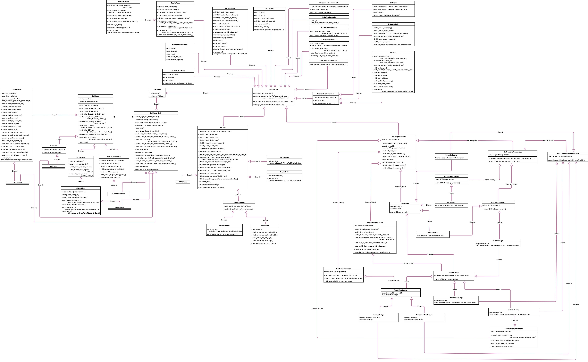

# timing

## Overview

`timing` provides a low-level C++ interface to the [`HD` timing firmware](https://gitlab.cern.ch/dune-daq/timing/timing-board-firmware). The `HD` timing firmware is highly modular. Several "base" firmware blocks are re-used and combined in different patterns to obtain different functionality, e.g. `master` vs. `endpoint`. The same top level firmware design can also run on several different `IO`/`FPGA`  board combinations. The C++ code structure is envisioned to loosely mirror the structure of the firmware. For each firmware block, there is usually a C++ class which provides the necessary interface to control and monitor the firmware block. Certain firmware blocks also contain data event buffers which can be read out via the corresponding C++ class.

In order to facilitate rapid code prototyping, and low level debugging of hardware, firmware, and software, `timing` provides a python interface to a large section of the C++ code. The python binding of C++ code is achieved using the header only library `pybind11`, see: [daq_add_python_bindings](https://dune-daq-sw.readthedocs.io/en/latest/packages/daq-cmake/#daq_add_python_bindings).

This package also provides the necessary schema and interface for the collection of operational monitoring information from the firmware and hardware supported by `timing`.

The different facets of the functionality provided `timing` are described in more detail in the following sections.

## C++ firmware interface
All the C++ firmware interface classes are compiled into a single "core" library, `libtiming.so`, which other libraries or plugins within the DUNE DAQ environment can link against.
### IPBus
Communication with firmware running on FPGA based hardware is achieved using [`IPBus`](https://ipbus.web.cern.ch/doc/user/html/index.html), a packet-based control protocol for reading and modifying memory-mapped resources within FPGA-based hardware devices. The IPBus suite of software and firmware consists of the following components:

* firmware modules implementing the `IPbus` protocol within end-user firmware
* `uHAL`, providing an end-user C++/Python API for `IPbus` reads, writes and RMW (read-modify-write) transactions
* `ControlHub`, a software application that mediates simultaneous hardware access from multiple `uHAL` clients, and implements the `IPbus` reliability mechanism over UDP

The `IPBus` protocol provides the low-level communication operations, e.g. reading and writing firmware registers. These low level operations can then be grouped together into higher level functions, e.g. board reset or clocking IC configuration. A set C++ classes implement these functions, whilst also retaining access to the lower level read and write operations.

The memory layout of the various firmware blocks which make up a firmware is captured using [`IPBus` address maps](https://ipbus.web.cern.ch/doc/user/html/software/uhalQuickTutorial.html#creating-an-address-table). These address maps allow the association of a particular firmware block with a particular C++ class. `timing` takes advantage of this feature to build its C++ firmware interface. The address maps of the various firmware designs supported by `timing` can be found in `config/etc/addrtab/`.

### Class hierarchy
The interface for reading and writing registers of hierarchal firmware blocks or `nodes` is provided by the `IPBus` class, `uhal::Node`. Most `timing` C++ classes inherit from `uhal::Node`, via the common base class `timing::TimingNode`. The class hierarchy of `timing` can be seen in the `UML` diagram below.

## Python interface
The C++ interface described above will be used by DUNE DAQ modules, written in C++, to control and monitor timing hardware. These DUNE DAQ modules can be found in the package, [`timinglibs`](https://github.com/DUNE-DAQ/timinglibs/). The interface provided by `timing` can also be used in a debug and development contexts, where python bindings allow exactly the same C++ code to be used in production or debug environments.
### Bindings
The python binding is done using the library `pybind11`. The source files in the directory `pybindsrc`, expose the relevant C++ code via the sub-module `core`, which belongs to the package top level python module, `timing`. 
### CLI
To enhance the usability of the python bound C++ code, a command line interface (`CLI`) has been built using the `click` python package. The `CLI` is centred around command groups, where each command group targets a particular set of firmware blocks or functionalities. These command groups are listed below.
* `io` : commands for interacting with the firmware block responsible for controlling the `IO` board, e.g. `SFP`s, `CDR` and `PLL` `IC`s. 
* `mst` : commands for manipulating the firmware blocks providing the `timing master` functionality
* `ept` : commands for manipulating the firmware blocks providing the `timing endpoint` functionality
* `hsi` : commands for manipulating the firmware blocks providing the `HSI` functionality
* `crt` : commands for manipulating the firmware blocks providing the `CRT endpoint` functionality
* `debug` : commands for various debug operations targeting hardware and firmware

The `CLI` is invoked through the executable python script, `pdtbutler`, located in the `scripts` directory.

## Operational monitoring
A portion of the firmware interface classes implement a `get_info` method. The method takes as an arugment, a reference to a data structure, which it fills with its particular operational monitoring information. Several of these operational monitoring structures are combined together into one super-structure, which holds all the relevant information, e.g. hardware *and* firmware, about a particular timing device. The data structures are defined by schema, written in the language of `jsonnet`. These schema are turned into C++ `struct`s using the [`daq_codegen` `cmake` function](https://dune-daq-sw.readthedocs.io/en/latest/packages/daq-cmake/#daq_codegen).